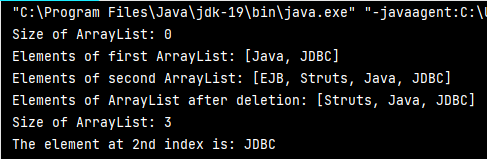

## Ex-09 Write a program to add, retrieve and remove the element from the ArrayList.
## Aim:-
To write a Java program to add , remove, retrieve an element in an Array.

## Algorithm:-
### Step 1 : 
Open Intelli J application or any other code editor.

### Step 2 : 
Create an array with a name of your choice.

### Step 3 : 
Using Scanner, Input a number or a element from the user.

### Step 4 : 
Using for loop insert,remove,retrieve the input element at the end of the array.

### Step 5 : 
Display the appended array in the terminal.

## Program:-
#### Developed By : Sarankumar J
#### Register Number : 212221230087
```java
import java.util.*;
class ArrayListDemo
{
public static void main(String[] args)
{
ArrayList<String> al = new ArrayList<String>();
System.out.println("Size of ArrayList: "+al.size());
//Adding the elements
al.add("Java");
al.add("JDBC");
System.out.println("Elements of first ArrayList: "+al);
ArrayList<String> al2 = new ArrayList<String>();
al2.add("EJB");
al2.add("Struts");
//Adding the both array
al2.addAll(al);
System.out.println("Elements of second ArrayList: "+al2);
//remove the element
al2.remove("EJB");
System.out.println("Elements of ArrayList after deletion: "+al2);
System.out.println("Size of ArrayList: "+al2.size());
//Retriving 2nd index element
System.out.println("The element at 2nd index is: "+al2.get(2));
}
}
```
## Output:-


## Result:-
We have successfully created a Java program to add , remove, retrieve an element in an Array.
